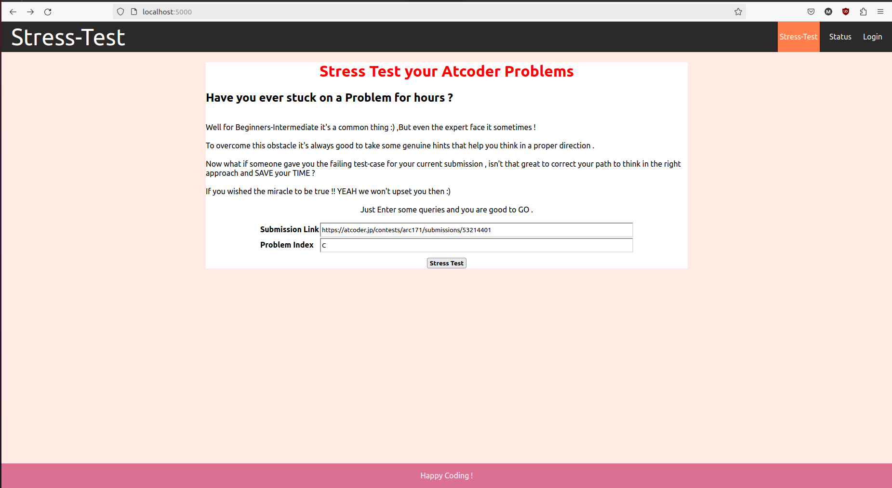
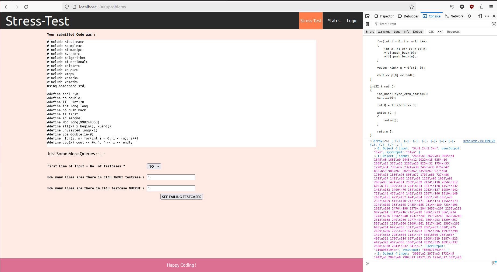

# Stress-Test Your Atcoder Problems online.

For streamlined code debugging on Atcoder,
I leverage the platform’s test cases and user inputs. I
isolate each test case, dry run the user’s code, retrieve
expected outputs, and compare them to editorial solutions. This iterative process efficiently pinpoints discrepancies, aiding in quick identification of failing test
cases.
 

## How to Use :
since the website is not hosted yet , you need to do it manually by hosting it locally .  
Create a build of the React App and run the `node index.js`  from inside the server folder.
1. Download the your contest Testcase folder from [Atcoder-dropBox](https://www.dropbox.com/sh/nx3tnilzqz7df8a/AAAYlTq2tiEHl5hsESw6-yfLa?dl=0) , and place  it in  a directory  "atcoder_testcases" .This directory is needed to be placed just before the project directory.
   It will be fetched from index.js file `    const folderPath = "../../../atcoder_testcases/"+contestNumber+"/"+problemIndex;
   `
2. In the homepage enter you submission-link.  
3. Then enter the queries asked regarding testcase parameter.   
4. Then click on "Failing testcases" to see the  failing testcase (for now , the failing cases are displayed in console log ; crtl+shift+I).

For Self Trial , You can use the following submission-link :
https://atcoder.jp/contests/arc171/submissions/53214401

## Current Limitations :
1. Unable to store output for large testcase files (Node.js heap out of memory).
2. Does not work with variable lines of each testcase input and output.
 
## Future Targets :
1. Work on writing own testcase to hunt down failing testcases more quickly .
2. Remove the need to depend on user's input to separate out individual testcase , maybe and AI tool would help .
3. Add previous submissions feature of user's problems submitted at Atcoder.  
  
Contributions are welcomed !
